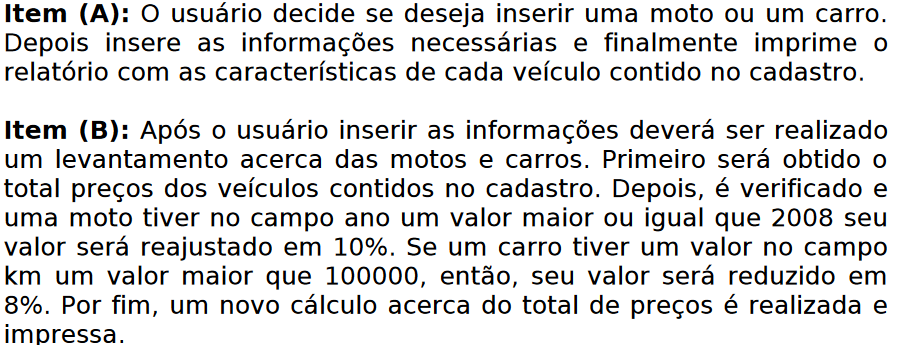
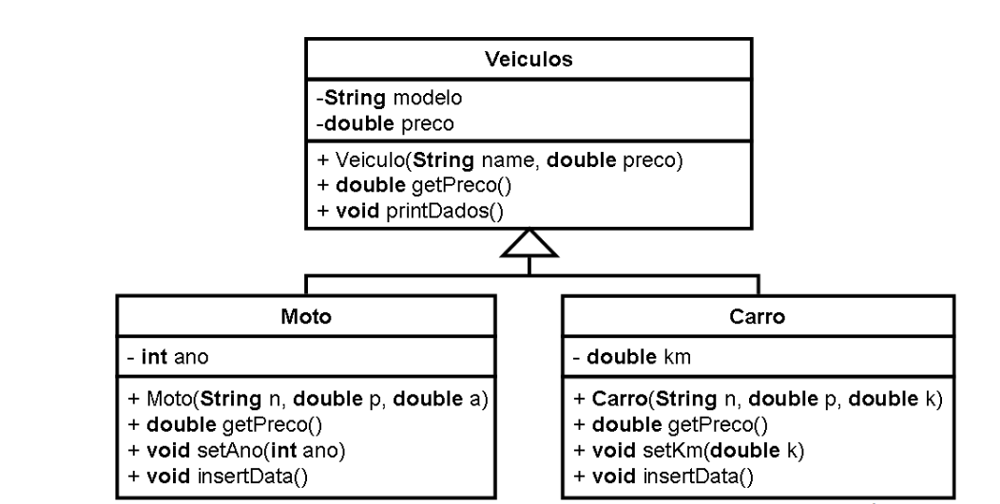

# Programação Orientada à Objetos

* Trabalho de Orientação a objetos em Java

## - Polimorfismo

Postar o programa solicitado durante a aula, ou seja, a leitura do diagrama UML e a criação do programa para ler e imprimir os veículos "em estoque".

### Enunciado:

### Diagrama:
